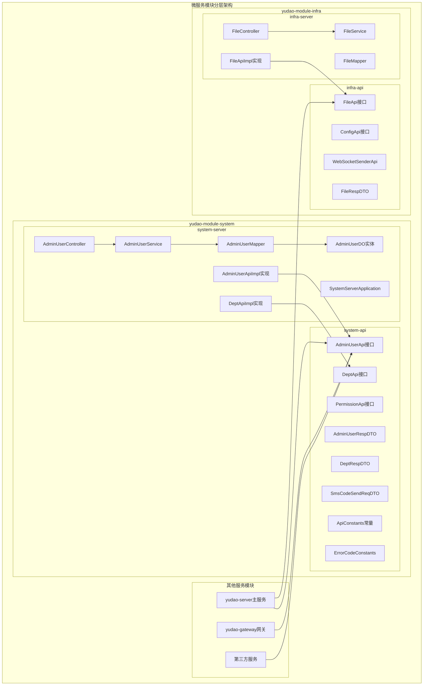
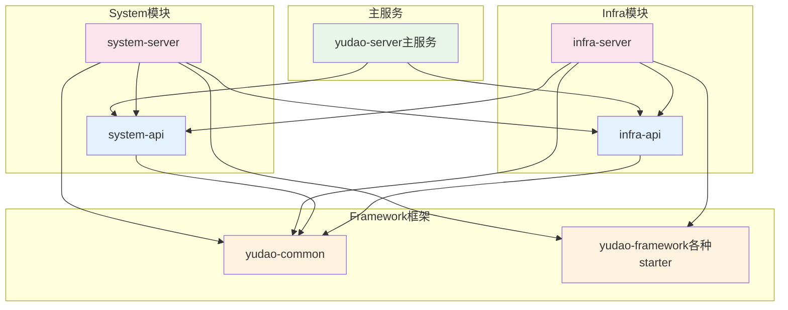
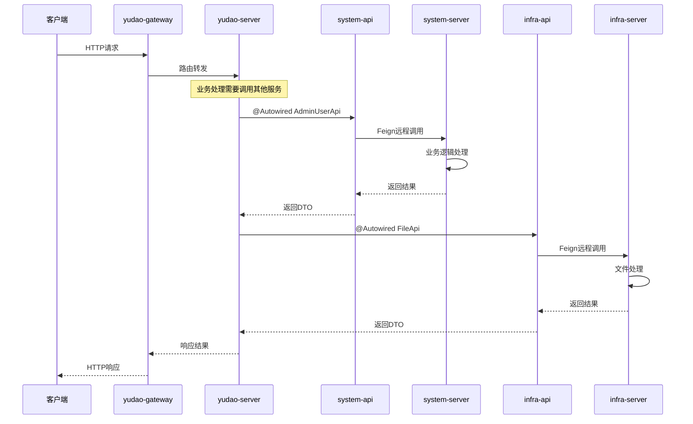

# 芋道云微服务模块分层架构设计分析

> **文档说明**：本文档深入分析芋道云项目中独特的API/Server分离架构设计，帮助开发者理解现代微服务架构的最佳实践。

## 📋 目录

- [1. 项目概览](#1-项目概览)
  - [1.1 项目背景](#11-项目背景)
  - [1.2 技术栈](#12-技术栈)
  - [1.3 模块划分](#13-模块划分)
- [2. 架构设计原理](#2-架构设计原理)
  - [2.1 API/Server分离的核心优势](#21-apiserver分离的核心优势)
  - [2.2 架构设计图](#22-架构设计图)
- [3. 职责划分说明](#3-职责划分说明)
  - [3.1 API模块职责](#31-api模块职责)
  - [3.2 Server模块职责](#32-server模块职责)
- [4. 依赖关系分析](#4-依赖关系分析)
  - [4.1 模块依赖层次](#41-模块依赖层次)
  - [4.2 依赖关系图](#42-依赖关系图)
  - [4.3 依赖关系特点](#43-依赖关系特点)
- [5. 代码组织结构](#5-代码组织结构)
  - [5.1 API模块代码组织](#51-api模块代码组织)
  - [5.2 Server模块代码组织](#52-server模块代码组织)
- [6. 实际应用场景](#6-实际应用场景)
  - [6.1 微服务间调用场景](#61-微服务间调用场景)
  - [6.2 服务注册与发现](#62-服务注册与发现)
  - [6.3 网关路由配置](#63-网关路由配置)
  - [6.4 微服务调用流程](#64-微服务调用流程)
  - [6.5 数据传输对象设计](#65-数据传输对象设计)
  - [6.6 错误处理和容错机制](#66-错误处理和容错机制)
- [7. 最佳实践总结](#7-最佳实践总结)
  - [7.1 接口设计最佳实践](#71-接口设计最佳实践)
  - [7.2 实现层最佳实践](#72-实现层最佳实践)
  - [7.3 配置管理最佳实践](#73-配置管理最佳实践)
- [8. 设计模式分析](#8-设计模式分析)
- [9. 总结](#9-总结)
  - [9.1 架构优势](#91-架构优势)
  - [9.2 适用场景](#92-适用场景)
  - [9.3 技术要点总结](#93-技术要点总结)
  - [9.4 学习建议](#94-学习建议)
  - [9.5 扩展思考](#95-扩展思考)

## 1. 项目概览

### 1.1 项目背景

芋道云（yudao-cloud-mini）是芋道源码团队开源的企业级快速开发平台的**精简版本**，基于 **JDK 17 + Spring Boot 3.4.5 + Spring Cloud 2024** 构建。项目采用了独特的 **API/Server 分离架构**，是现代微服务架构设计的典型代表。

**项目特点：**
- 🔥 **完全开源**：MIT协议，个人与企业可100%免费使用
- 🚀 **技术先进**：基于最新的Spring Boot 3.x和Spring Cloud 2024
- 💡 **架构清晰**：采用DDD领域驱动设计和微服务最佳实践
- 🛡️ **功能完整**：包含用户管理、权限控制、多租户、工作流等企业级功能

### 1.2 技术栈

#### 核心框架
| 技术 | 版本 | 说明 |
|------|------|------|
| Spring Boot | 3.4.5 | 基础框架 |
| Spring Cloud | 2024.0.1 | 微服务框架 |
| Spring Cloud Alibaba | 2023.0.3.2 | 阿里云微服务组件 |
| Spring Security | 6.3.1 | 安全认证框架 |

#### 数据存储
| 技术 | 版本 | 说明 |
|------|------|------|
| MyBatis Plus | 3.5.12 | ORM框架 |
| MySQL | 5.7/8.0+ | 关系型数据库 |
| Redis | 5.0/6.0 | 缓存数据库 |
| Redisson | 3.41.0 | Redis客户端 |

#### 微服务组件
| 技术 | 版本 | 说明 |
|------|------|------|
| Nacos | 2.3.2 | 注册中心&配置中心 |
| Gateway | 4.1.0 | 服务网关 |
| Sentinel | 1.8.6 | 服务保障 |
| Seata | 1.6.1 | 分布式事务 |

### 1.3 模块划分

每个业务模块都被拆分为两个子模块：
- **API模块**：定义服务接口契约和数据传输对象
- **Server模块**：实现具体的业务逻辑和数据访问

#### 主要业务模块

| 模块 | API模块 | Server模块 | 功能描述 |
|------|---------|------------|----------|
| system | yudao-module-system-api | yudao-module-system-server | 用户管理、角色权限、菜单管理、部门管理等 |
| infra | yudao-module-infra-api | yudao-module-infra-server | 代码生成、文件管理、定时任务、API日志等 |
| bpm | yudao-module-bpm-api | yudao-module-bpm-server | 工作流程管理、流程设计器等 |
| pay | yudao-module-pay-api | yudao-module-pay-server | 支付系统、退款管理等 |
| mall | yudao-module-mall-api | yudao-module-mall-server | 商城系统、商品管理等 |

## 2. 架构设计原理

### 2.1 API/Server 分离的核心优势

#### 🔹 接口与实现分离
- **契约优先**：API模块定义服务契约，确保接口稳定性
- **实现隐藏**：Server模块隐藏具体实现细节，降低耦合度
- **版本管理**：API版本独立演进，向后兼容更容易

#### 🔹 微服务架构支持
- **服务发现**：通过 `@FeignClient` 实现服务间调用
- **负载均衡**：支持多实例部署和负载均衡
- **故障隔离**：单个服务故障不影响整体系统

#### 🔹 开发效率提升
- **并行开发**：API定义后，前端和后端可并行开发
- **接口复用**：API模块可被多个服务复用
- **测试友好**：接口和实现分离，便于单元测试

### 2.2 架构设计图



## 3. 职责划分说明

### 3.1 API 模块职责

API模块作为**服务契约层**，主要负责：

#### 🔸 Feign接口定义
```java
@FeignClient(name = ApiConstants.NAME) // Feign客户端声明
@Tag(name = "RPC 服务 - 管理员用户")
@AutoTrans(namespace = PREFIX, fields = {"nickname"})
public interface AdminUserApi extends AutoTransable<AdminUserRespDTO> {
    
    String PREFIX = ApiConstants.PREFIX + "/user";
    
    @GetMapping(PREFIX + "/get")
    @Operation(summary = "通过用户 ID 查询用户")
    @Parameter(name = "id", description = "用户编号", example = "1", required = true)
    CommonResult<AdminUserRespDTO> getUser(@RequestParam("id") Long id);
    
    @GetMapping(PREFIX + "/list")
    @Operation(summary = "通过用户 ID 查询用户们")
    CommonResult<List<AdminUserRespDTO>> getUserList(@RequestParam("ids") Collection<Long> ids);
}
```

#### 🔸 DTO数据传输对象
```java
@Schema(description = "RPC 服务 - Admin 用户 Response DTO")
@Data
public class AdminUserRespDTO implements VO {
    
    @Schema(description = "用户 ID", requiredMode = Schema.RequiredMode.REQUIRED, example = "1024")
    private Long id;
    
    @Schema(description = "用户昵称", requiredMode = Schema.RequiredMode.REQUIRED, example = "小王")
    private String nickname;
    
    @Schema(description = "帐号状态", requiredMode = Schema.RequiredMode.REQUIRED, example = "1")
    private Integer status; // 参见 CommonStatusEnum 枚举
}
```

#### 🔸 业务常量和枚举
```java
public class ApiConstants {
    /**
     * 服务名 - 需要保证和 spring.application.name 保持一致
     */
    public static final String NAME = "system-server";
    
    public static final String PREFIX = RpcConstants.RPC_API_PREFIX +  "/system";
    
    public static final String VERSION = "1.0.0";
}
```

#### 🔸 便捷方法提供
```java
// API接口中的默认方法，简化调用
default Map<Long, AdminUserRespDTO> getUserMap(Collection<Long> ids) {
    List<AdminUserRespDTO> users = getUserList(ids).getCheckedData();
    return CollectionUtils.convertMap(users, AdminUserRespDTO::getId);
}

default void validateUser(Long id) {
    validateUserList(Collections.singleton(id));
}
```

#### 🔸 API模块完整示例
```java
// 完整的API接口定义示例
@FeignClient(name = ApiConstants.NAME)
@Tag(name = "RPC 服务 - 部门")
public interface DeptApi {

    String PREFIX = ApiConstants.PREFIX + "/dept";

    @GetMapping(PREFIX + "/get")
    @Operation(summary = "获得部门信息")
    @Parameter(name = "id", description = "部门编号", example = "1024", required = true)
    CommonResult<DeptRespDTO> getDept(@RequestParam("id") Long id);

    @GetMapping(PREFIX + "/list")
    @Operation(summary = "获得部门信息数组")
    @Parameter(name = "ids", description = "部门编号数组", example = "1,2", required = true)
    CommonResult<List<DeptRespDTO>> getDeptList(@RequestParam("ids") Collection<Long> ids);

    @GetMapping(PREFIX + "/valid")
    @Operation(summary = "校验部门是否合法")
    @Parameter(name = "ids", description = "部门编号数组", example = "1,2", required = true)
    CommonResult<Boolean> validateDeptList(@RequestParam("ids") Collection<Long> ids);
}
```

### 3.2 Server 模块职责

Server模块作为**服务实现层**，主要负责：

#### 🔸 API接口实现
```java
@RestController // 提供 RESTful API 接口，给 Feign 调用
@Validated
public class AdminUserApiImpl implements AdminUserApi {
    
    @Resource
    private AdminUserService userService;
    @Resource
    private DeptService deptService;
    
    @Override
    public CommonResult<AdminUserRespDTO> getUser(Long id) {
        AdminUserDO user = userService.getUser(id);
        return success(BeanUtils.toBean(user, AdminUserRespDTO.class));
    }
    
    @Override
    public CommonResult<List<AdminUserRespDTO>> getUserList(Collection<Long> ids) {
        return DataPermissionUtils.executeIgnore(() -> { // 禁用数据权限
            List<AdminUserDO> users = userService.getUserList(ids);
            return success(BeanUtils.toBean(users, AdminUserRespDTO.class));
        });
    }
}
```

#### 🔸 HTTP控制器层
```java
@Tag(name = "管理后台 - 用户")
@RestController
@RequestMapping("/system/user")
@Validated
public class UserController {
    
    @Resource
    private AdminUserService userService;
    
    @PostMapping("/create")
    @Operation(summary = "新增用户")
    @PreAuthorize("@ss.hasPermission('system:user:create')")
    public CommonResult<Long> createUser(@Valid @RequestBody UserSaveReqVO createReqVO) {
        Long userId = userService.createUser(createReqVO);
        return success(userId);
    }
}
```

#### 🔸 业务服务层
```java
@Service
@Validated
@Slf4j
public class AdminUserServiceImpl implements AdminUserService {
    
    @Resource
    private AdminUserMapper userMapper;
    
    @Override
    @Transactional(rollbackFor = Exception.class)
    public Long createUser(UserSaveReqVO createReqVO) {
        // 1. 校验正确性
        validateUserForCreateOrUpdate(null, createReqVO.getUsername(),
                createReqVO.getMobile(), createReqVO.getEmail(), 
                createReqVO.getDeptId(), createReqVO.getPostIds());
        
        // 2. 插入用户
        AdminUserDO user = BeanUtils.toBean(createReqVO, AdminUserDO.class);
        user.setStatus(CommonStatusEnum.ENABLE.getStatus());
        user.setPassword(encodePassword(createReqVO.getPassword()));
        userMapper.insert(user);
        
        return user.getId();
    }
}
```

#### 🔸 数据访问层
```java
@Mapper
public interface AdminUserMapper extends BaseMapperX<AdminUserDO> {

    default AdminUserDO selectByUsername(String username) {
        return selectOne(AdminUserDO::getUsername, username);
    }

    default AdminUserDO selectByMobile(String mobile) {
        return selectOne(AdminUserDO::getMobile, mobile);
    }

    default PageResult<AdminUserDO> selectPage(UserPageReqVO reqVO,
                                               Collection<Long> deptIds) {
        return selectPage(reqVO, new LambdaQueryWrapperX<AdminUserDO>()
                .likeIfPresent(AdminUserDO::getUsername, reqVO.getUsername())
                .likeIfPresent(AdminUserDO::getMobile, reqVO.getMobile())
                .eqIfPresent(AdminUserDO::getStatus, reqVO.getStatus())
                .inIfPresent(AdminUserDO::getDeptId, deptIds)
                .orderByDesc(AdminUserDO::getId));
    }
}
```

#### 🔸 数据实体对象
```java
@TableName("system_users")
@Data
@EqualsAndHashCode(callSuper = true)
@Builder
@NoArgsConstructor
@AllArgsConstructor
public class AdminUserDO extends BaseDO {

    /**
     * 用户ID
     */
    @TableId
    private Long id;

    /**
     * 用户账号
     */
    private String username;

    /**
     * 加密后的密码
     */
    private String password;

    /**
     * 用户昵称
     */
    private String nickname;

    /**
     * 用户邮箱
     */
    private String email;

    /**
     * 手机号码
     */
    private String mobile;

    /**
     * 用户性别
     */
    private Integer sex;

    /**
     * 用户头像
     */
    private String avatar;

    /**
     * 帐号状态（0正常 1停用）
     */
    private Integer status;

    /**
     * 部门ID
     */
    private Long deptId;

    /**
     * 岗位编号数组
     */
    @TableField(typeHandler = JsonLongSetTypeHandler.class)
    private Set<Long> postIds;
}
```

## 4. 依赖关系分析

### 4.1 模块依赖层次

#### API模块依赖（轻量级）
```xml
<!-- yudao-module-system-api/pom.xml -->
<dependencies>
    <!-- 只依赖基础框架 -->
    <dependency>
        <groupId>cn.iocoder.cloud</groupId>
        <artifactId>yudao-common</artifactId>
    </dependency>
    
    <!-- 接口文档支持 -->
    <dependency>
        <groupId>org.springdoc</groupId>
        <artifactId>springdoc-openapi-starter-webmvc-api</artifactId>
        <scope>provided</scope>
    </dependency>
    
    <!-- RPC 远程调用 -->
    <dependency>
        <groupId>org.springframework.cloud</groupId>
        <artifactId>spring-cloud-starter-openfeign</artifactId>
        <optional>true</optional>
    </dependency>
</dependencies>
```

#### Server模块依赖（完整功能）
```xml
<!-- yudao-module-system-server/pom.xml -->
<dependencies>
    <!-- 依赖自己的API模块 -->
    <dependency>
        <groupId>cn.iocoder.cloud</groupId>
        <artifactId>yudao-module-system-api</artifactId>
        <version>${revision}</version>
    </dependency>
    
    <!-- 依赖其他模块的API -->
    <dependency>
        <groupId>cn.iocoder.cloud</groupId>
        <artifactId>yudao-module-infra-api</artifactId>
        <version>${revision}</version>
    </dependency>
    
    <!-- 业务组件 -->
    <dependency>
        <groupId>cn.iocoder.cloud</groupId>
        <artifactId>yudao-spring-boot-starter-biz-tenant</artifactId>
    </dependency>
    
    <!-- 数据库相关 -->
    <dependency>
        <groupId>cn.iocoder.cloud</groupId>
        <artifactId>yudao-spring-boot-starter-mybatis</artifactId>
    </dependency>
    
    <!-- 安全认证 -->
    <dependency>
        <groupId>cn.iocoder.cloud</groupId>
        <artifactId>yudao-spring-boot-starter-security</artifactId>
    </dependency>
</dependencies>
```

### 4.2 依赖关系图



### 4.3 依赖关系特点

- ✅ **Server依赖API**：Server模块依赖自己的API模块
- ✅ **跨模块API依赖**：只依赖其他模块的API，不依赖Server
- ✅ **单向依赖**：避免循环依赖，保持架构清晰
- ✅ **轻量级API**：API模块依赖最小化，便于分发

## 5. 代码组织结构

### 5.1 API模块代码组织

```
yudao-module-system-api/
├── src/main/java/cn/iocoder/yudao/module/system/
│   ├── api/                    # Feign接口定义
│   │   ├── user/
│   │   │   ├── AdminUserApi.java      # 用户API接口
│   │   │   └── dto/
│   │   │       ├── AdminUserRespDTO.java  # 响应DTO
│   │   │       └── AdminUserReqDTO.java   # 请求DTO
│   │   ├── dept/
│   │   │   ├── DeptApi.java           # 部门API接口
│   │   │   └── dto/
│   │   │       └── DeptRespDTO.java
│   │   ├── permission/
│   │   │   ├── PermissionApi.java     # 权限API接口
│   │   │   └── dto/
│   │   └── sms/
│   │       ├── SmsCodeApi.java        # 短信API接口
│   │       └── dto/
│   └── enums/                  # 枚举和常量
│       ├── ApiConstants.java          # API常量
│       ├── ErrorCodeConstants.java    # 错误码
│       ├── DictTypeConstants.java     # 字典类型
│       └── LogRecordConstants.java    # 日志记录常量
└── pom.xml                     # 轻量级依赖配置
```

### 5.2 Server模块代码组织

```
yudao-module-system-server/
├── src/main/java/cn/iocoder/yudao/module/system/
│   ├── SystemServerApplication.java   # 启动类
│   ├── api/                    # API接口实现
│   │   ├── user/
│   │   │   └── AdminUserApiImpl.java  # API实现类
│   │   ├── dept/
│   │   │   └── DeptApiImpl.java
│   │   └── permission/
│   ├── controller/             # HTTP控制器
│   │   ├── admin/              # 管理端接口
│   │   │   ├── user/
│   │   │   │   └── UserController.java
│   │   │   └── dept/
│   │   └── app/                # 用户端接口
│   ├── service/                # 业务服务层
│   │   ├── user/
│   │   │   ├── AdminUserService.java      # 服务接口
│   │   │   └── AdminUserServiceImpl.java  # 服务实现
│   │   ├── dept/
│   │   │   ├── DeptService.java
│   │   │   └── DeptServiceImpl.java
│   │   └── permission/
│   ├── dal/                    # 数据访问层
│   │   ├── dataobject/         # 数据对象
│   │   │   ├── user/
│   │   │   │   └── AdminUserDO.java   # 数据实体
│   │   │   └── dept/
│   │   │       └── DeptDO.java
│   │   ├── mysql/              # MySQL映射器
│   │   │   ├── user/
│   │   │   │   └── AdminUserMapper.java
│   │   │   └── dept/
│   │   └── redis/              # Redis操作
│   ├── convert/                # 对象转换器
│   │   ├── user/
│   │   │   └── UserConvert.java
│   │   └── auth/
│   ├── framework/              # 框架配置
│   │   ├── security/           # 安全配置
│   │   ├── datapermission/     # 数据权限
│   │   └── operatelog/         # 操作日志
│   ├── job/                    # 定时任务
│   └── mq/                     # 消息队列
│       ├── producer/           # 消息生产者
│       ├── consumer/           # 消息消费者
│       └── message/            # 消息定义
├── src/main/resources/
│   ├── application.yaml        # 配置文件
│   └── mapper/                 # MyBatis映射文件
└── pom.xml                     # 完整依赖配置
```

## 6. 实际应用场景

### 6.1 微服务间调用场景

#### 场景1：用户信息查询
```java
// 其他服务调用system模块的用户API
@Service
public class SomeBusinessService {
    
    @Resource
    private AdminUserApi adminUserApi; // 注入API接口
    
    public void processUserData(Long userId) {
        // 通过Feign调用远程服务
        AdminUserRespDTO user = adminUserApi.getUser(userId).getCheckedData();
        
        // 批量查询用户信息
        List<Long> userIds = Arrays.asList(1L, 2L, 3L);
        Map<Long, AdminUserRespDTO> userMap = adminUserApi.getUserMap(userIds);
        
        // 业务逻辑处理...
    }
}
```

#### 场景2：文件上传服务
```java
// system模块调用infra模块的文件API
@Service
public class UserAvatarService {
    
    @Resource
    private FileApi fileApi; // 注入文件API
    
    public String uploadAvatar(Long userId, MultipartFile file) {
        // 调用文件服务上传头像
        String fileUrl = fileApi.createFile(file).getCheckedData();
        
        // 更新用户头像信息
        userService.updateUserAvatar(userId, fileUrl);
        
        return fileUrl;
    }
}
```

### 6.2 服务注册与发现

#### Feign客户端配置
```java
// API模块中的Feign客户端声明
@FeignClient(name = ApiConstants.NAME) // 服务名：system-server
public interface AdminUserApi {
    // 接口定义...
}
```

#### 服务提供者配置
```yaml
# system-server的application.yaml
spring:
  application:
    name: system-server  # 与ApiConstants.NAME保持一致
  cloud:
    nacos:
      discovery:
        enabled: true
        server-addr: 127.0.0.1:8848
```

### 6.3 网关路由配置

```yaml
# yudao-gateway的路由配置
spring:
  cloud:
    gateway:
      routes:
        # system-server 服务路由
        - id: system-admin-api
          uri: grayLb://system-server  # 负载均衡到system-server
          predicates:
            - Path=/admin-api/system/**
          filters:
            - RewritePath=/admin-api/system/v3/api-docs, /v3/api-docs

        # infra-server 服务路由
        - id: infra-admin-api
          uri: grayLb://infra-server
          predicates:
            - Path=/admin-api/infra/**
```

### 6.4 微服务调用流程



### 6.5 数据传输对象设计

#### 请求DTO设计
```java
@Schema(description = "管理后台 - 用户创建/修改 Request VO")
@Data
public class UserSaveReqVO {

    @Schema(description = "用户编号", example = "1")
    private Long id;

    @Schema(description = "用户账号", requiredMode = Schema.RequiredMode.REQUIRED, example = "yudao")
    @NotBlank(message = "用户账号不能为空")
    @Pattern(regexp = "^[a-zA-Z0-9]{4,30}$", message = "用户账号由 数字、字母 组成")
    @Size(min = 4, max = 30, message = "用户账号长度为 4-30 个字符")
    private String username;

    @Schema(description = "密码", requiredMode = Schema.RequiredMode.REQUIRED, example = "123456")
    @Length(min = 4, max = 16, message = "密码长度为 4-16 位")
    private String password;
}
```

#### 响应DTO设计
```java
@Schema(description = "RPC 服务 - Admin 用户 Response DTO")
@Data
public class AdminUserRespDTO implements VO {

    @Schema(description = "用户 ID", requiredMode = Schema.RequiredMode.REQUIRED, example = "1024")
    private Long id;

    @Schema(description = "用户昵称", requiredMode = Schema.RequiredMode.REQUIRED, example = "小王")
    private String nickname;

    @Schema(description = "帐号状态", requiredMode = Schema.RequiredMode.REQUIRED, example = "1")
    private Integer status; // 参见 CommonStatusEnum 枚举

    @Schema(description = "部门编号", requiredMode = Schema.RequiredMode.REQUIRED, example = "1")
    private Long deptId;

    @Schema(description = "岗位编号数组", requiredMode = Schema.RequiredMode.REQUIRED, example = "[1, 3]")
    private Set<Long> postIds;
}

### 6.6 错误处理和容错机制

#### 统一异常处理
```java
@RestController
@Validated
public class AdminUserApiImpl implements AdminUserApi {

    @Override
    public CommonResult<Boolean> validateUserList(Collection<Long> ids) {
        try {
            userService.validateUserList(ids);
            return success(true);
        } catch (ServiceException ex) {
            // 业务异常统一处理
            return CommonResult.error(ex.getCode(), ex.getMessage());
        }
    }
}
```

#### Feign容错配置
```java
// 可以配置Feign的fallback机制
@FeignClient(name = ApiConstants.NAME, fallbackFactory = AdminUserApiFallbackFactory.class)
public interface AdminUserApi {
    // 接口定义...
}

@Component
public class AdminUserApiFallbackFactory implements FallbackFactory<AdminUserApi> {
    @Override
    public AdminUserApi create(Throwable cause) {
        return new AdminUserApi() {
            @Override
            public CommonResult<AdminUserRespDTO> getUser(Long id) {
                log.error("调用用户服务失败", cause);
                return CommonResult.error(500, "用户服务暂时不可用");
            }
        };
    }
}
```

## 7. 最佳实践总结

### 7.1 接口设计最佳实践

#### 🔹 统一返回格式
```java
// 所有API都使用CommonResult包装返回结果
public interface AdminUserApi {
    CommonResult<AdminUserRespDTO> getUser(@RequestParam("id") Long id);
    CommonResult<List<AdminUserRespDTO>> getUserList(@RequestParam("ids") Collection<Long> ids);
    CommonResult<Boolean> validateUserList(@RequestParam("ids") Collection<Long> ids);
}
```

#### 🔹 参数校验规范
```java
@Schema(description = "RPC 服务 - 短信验证码的发送 Request DTO")
@Data
public class SmsCodeSendReqDTO {
    
    @Schema(description = "手机号", requiredMode = Schema.RequiredMode.REQUIRED)
    @Mobile
    @NotEmpty(message = "手机号不能为空")
    private String mobile;
    
    @Schema(description = "发送场景", requiredMode = Schema.RequiredMode.REQUIRED)
    @NotNull(message = "发送场景不能为空")
    @InEnum(SmsSceneEnum.class)
    private Integer scene;
}
```

#### 🔹 接口文档规范
```java
@GetMapping(PREFIX + "/get")
@Operation(summary = "通过用户 ID 查询用户")
@Parameter(name = "id", description = "用户编号", example = "1", required = true)
CommonResult<AdminUserRespDTO> getUser(@RequestParam("id") Long id);
```

### 7.2 实现层最佳实践

#### 🔹 数据权限控制
```java
@Override
public CommonResult<List<AdminUserRespDTO>> getUserList(Collection<Long> ids) {
    return DataPermissionUtils.executeIgnore(() -> { // 禁用数据权限
        List<AdminUserDO> users = userService.getUserList(ids);
        return success(BeanUtils.toBean(users, AdminUserRespDTO.class));
    });
}
```

#### 🔹 对象转换规范
```java
// 使用MapStruct进行对象转换，避免手动映射
AdminUserDO user = userService.getUser(id);
return success(BeanUtils.toBean(user, AdminUserRespDTO.class));
```

#### 🔹 异常处理
```java
@Override
public CommonResult<Boolean> validateUserList(Collection<Long> ids) {
    try {
        userService.validateUserList(ids);
        return success(true);
    } catch (ServiceException ex) {
        return CommonResult.error(ex.getCode(), ex.getMessage());
    }
}
```

### 7.3 配置管理最佳实践

#### 🔹 服务配置隔离
```yaml
# system-server独立配置
yudao:
  info:
    version: 1.0.0
    base-package: cn.iocoder.yudao.module.system
  swagger:
    title: 系统管理模块
    description: 提供用户、角色、权限等系统管理功能
```

#### 🔹 多环境配置
```yaml
spring:
  profiles:
    active: local
  config:
    import:
      - optional:classpath:application-${spring.profiles.active}.yaml
      - optional:nacos:${spring.application.name}-${spring.profiles.active}.yaml
```

## 8. 设计模式分析

### 8.1 接口隔离原则 (ISP)
- 每个API接口职责单一，只暴露必要的方法
- 客户端只依赖它需要的接口，不依赖不需要的接口

### 8.2 依赖倒置原则 (DIP)
- 高层模块（调用方）依赖抽象（API接口）
- 低层模块（实现方）实现抽象，具体依赖抽象

### 8.3 外观模式 (Facade)
- API模块为复杂的业务逻辑提供简化的接口
- 隐藏内部实现的复杂性

### 8.4 适配器模式 (Adapter)
- API实现类作为适配器，将内部服务适配为外部接口
- 实现不同数据格式之间的转换

### 8.5 架构对比分析

#### 传统单体架构 vs API/Server分离架构

| 对比维度 | 传统单体架构 | API/Server分离架构 |
|----------|-------------|-------------------|
| **模块耦合度** | 高耦合，模块间直接依赖 | 低耦合，通过接口依赖 |
| **服务拆分** | 难以拆分，牵一发动全身 | 易于拆分，接口契约清晰 |
| **团队协作** | 串行开发，容易冲突 | 并行开发，减少冲突 |
| **版本管理** | 整体发布，风险较大 | 独立发布，风险可控 |
| **测试复杂度** | 集成测试复杂 | 单元测试简单，接口测试清晰 |
| **部署方式** | 整体部署 | 独立部署，支持灰度发布 |

#### 性能优势分析
```java
// API模块轻量级，启动快速
// 只包含接口定义和DTO，无业务逻辑
public interface AdminUserApi {
    // 接口定义，无实现代码
}

// Server模块功能完整，但可独立扩展
@RestController
public class AdminUserApiImpl implements AdminUserApi {
    // 完整的业务实现
    // 可独立部署多个实例实现负载均衡
}
```

## 9. 总结

### 9.1 架构优势

#### 🎯 开发效率
- **并行开发**：API定义后，多团队可并行开发
- **接口复用**：API模块可被多个服务复用
- **快速集成**：标准化的接口便于快速集成

#### 🎯 系统可维护性
- **职责清晰**：每个模块职责明确，便于维护
- **版本控制**：API版本独立管理，升级更安全
- **故障隔离**：服务间松耦合，故障影响范围小

#### 🎯 微服务架构支持
- **服务拆分**：支持按业务域拆分微服务
- **独立部署**：每个服务可独立部署和扩展
- **技术栈灵活**：不同服务可选择不同技术栈

### 9.2 适用场景

这种API/Server分离架构特别适合：

1. **企业级应用**：需要高可维护性和扩展性
2. **SaaS平台**：需要支持多租户和高并发
3. **微服务架构**：需要服务间解耦和独立部署
4. **团队协作**：多团队并行开发的大型项目

### 9.3 技术要点总结

#### 🔧 关键技术组件
- **Spring Cloud OpenFeign**：服务间调用
- **Spring Cloud Gateway**：API网关路由
- **Nacos**：服务注册与发现、配置管理
- **MyBatis Plus**：数据访问层增强
- **Spring Security**：安全认证框架

#### 🔧 核心设计理念
- **契约优先**：API接口作为服务契约
- **职责分离**：接口定义与实现分离
- **依赖管理**：清晰的模块依赖关系
- **标准化**：统一的编码规范和最佳实践

### 9.4 学习建议

#### 📚 学习路径
1. **理解设计思想**：先理解为什么要这样设计
2. **分析依赖关系**：理解模块间的依赖关系
3. **实践代码编写**：按照规范编写API和实现
4. **掌握配置管理**：学会配置Feign、Nacos等组件
5. **深入框架原理**：理解Spring Cloud的工作机制

#### 📚 实践建议
1. **从简单模块开始**：先学习system模块的基础功能
2. **关注接口设计**：重点学习API接口的设计规范
3. **理解数据流转**：跟踪数据在各层之间的流转过程
4. **掌握调试技巧**：学会调试微服务间的调用问题

### 9.5 扩展思考

#### 🤔 架构演进方向
- **服务网格**：考虑引入Istio等服务网格技术
- **事件驱动**：引入事件驱动架构模式
- **领域驱动**：结合DDD进行更细粒度的服务拆分
- **云原生**：向Kubernetes等云原生平台迁移

这种分层架构是现代微服务架构的**最佳实践之一**，不仅适用于芋道云项目，也可以作为其他微服务项目的架构参考。

---

*本文档基于芋道云项目 yudao-cloud-mini master-jdk17 分支分析整理*
*文档版本：v1.0*
*更新时间：2025-08-14*
